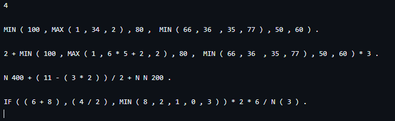
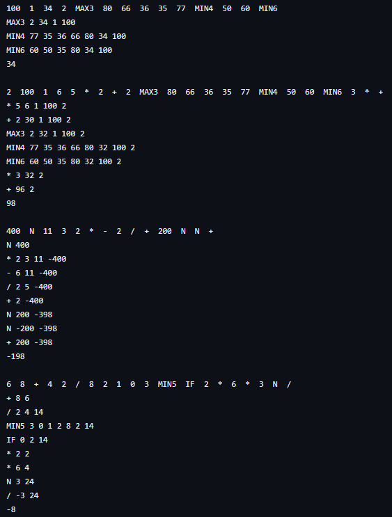

  <h1 align="center">ONP </h1>

  

    <h3>Calculator ONP(odwrotna notacja polska/reverse Polish notation)</h3>
     
  

# About:
<h4>This is a project I wrote as a university project in subject A&DS (Algorithms and Data Structures).</h4>

# Input:
 * n -number of formulas
 
 * n formulas, each in the form given below.
   
Each formula is a valid expression in an infix notation with functions and ends with a dot ('.'). Each token is separated by some whitespace characters. Each operand is a positive integer (although the result of an operation might be negative). Each operator is a single character and every function name consists only of capital letters.

The following operations are available, in the ascending order of priority:
* a + b, a - b ;
* a * b, a / b -all operations are made on integers, hence the results of division are rounded down (standard C '/' operator). You cannot divide by 0 (see the Output section);
* IF(a, b, c) -if a>0 return b, otherwise c,
* N a -unary negation, i.e. -a,
* MIN( a1, a2, ... ), MAX(a1, a2, ...) -functions MIN and MAX do not have a restriction on the number of parameters;
* ( ... ) -parentheses.
<h3>Example Input:</h3>

4

MIN ( 100 , MAX ( 1 , 34 , 2 ) , 80 ,  MIN ( 66 , 36  , 35 , 77 ) , 50 , 60 ) .

2 + MIN ( 100 , MAX ( 1 , 6 * 5 + 2 , 2 ) , 80 ,  MIN ( 66 , 36  , 35 , 77 ) , 50 , 60 ) * 3 .

N 400 + ( 11 - ( 3 * 2 ) ) / 2 + N N 200 .

IF ( ( 6 + 8 ) , ( 4 / 2 ) , MIN ( 8 , 2 , 1 , 0 , 3 ) ) * 2 * 6 / N ( 3 ) .

# Output for each formula:
* the formula in the postfix notation;

* before executing each operation print the operator or function and the content of the stack;

* the final result;

* if you encounter a division by 0, print "ERROR" and move to the next expression.

<h3>Example:</h3>

<h4>Input</h4>
    
    <h4>Output</h4>
  
